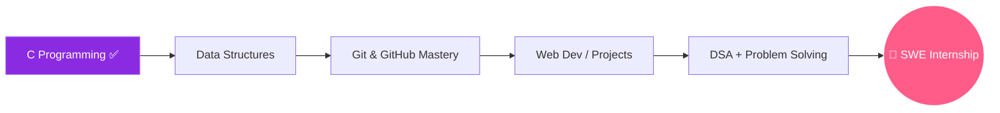

<div align="center">


<a href="https://git.io/typing-svg">
  
</a>

</div>

<br>


## 👨‍💻 About Me

```yaml
name: Harsh Verma
role: BCA Student @ Career Point University, Kota, Rajasthan
current_focus: Mastering C Programming (Daily Practice Streak 🔥)
learning_path: C → Data Structures → Web Development → Software Engineering
goal: Land a Software Engineering Internship in 2nd Year
fun_fact: I push code to GitHub every single day, no exceptions.
```


- 🎓 Currently pursuing **BCA** at **Career Point University, Kota**
- 🔥 On a **daily coding streak** — building strong logic through consistent practice
- 🌱 Currently learning **C Programming** (loops, patterns, control flow, problem-solving)
- 🛠️ Comfortable with **HTML**, **CSS**, **Linux OS**, **Git** & **GitHub**
- 🎯 Goal: Land a **Software Engineering Internship** in my 2nd year
- 💬 Ask me about: C fundamentals, Git workflows, or Linux basics
- ⚡ Fun fact: Consistency > Motivation — I show up every day

<br clear="both">


## 🧰 Tech Stack

<div align="center">


</div>

<br>

## 📊 GitHub Analytics

<div align="center">


<br>


<br><br>


</div>

<br>


## 🌱 Currently Learning

<div align="center">

| Stage | Topic | Status |
|:-----:|:------|:------:|
| 01 | C Programming — Loops, Patterns, Logic Building | 🟢 In Progress |
| 02 | Data Structures & Algorithms | ⚪ Upcoming |
| 03 | Object-Oriented Programming | ⚪ Upcoming |
| 04 | Web Development (Beyond HTML/CSS) | ⚪ Upcoming |
| 05 | DBMS & SQL | ⚪ Upcoming |

</div>

<br>

## 🎯 Roadmap to Internship



<br>

## 📫 Connect With Me

<div align="center">

<a href="https://github.com/hxverma-io" target="_blank">
  
</a>

</div>

<br>


<div align="center">

### 💡 "Consistency beats intensity — one loop, one line, one day at a time."


</div>


